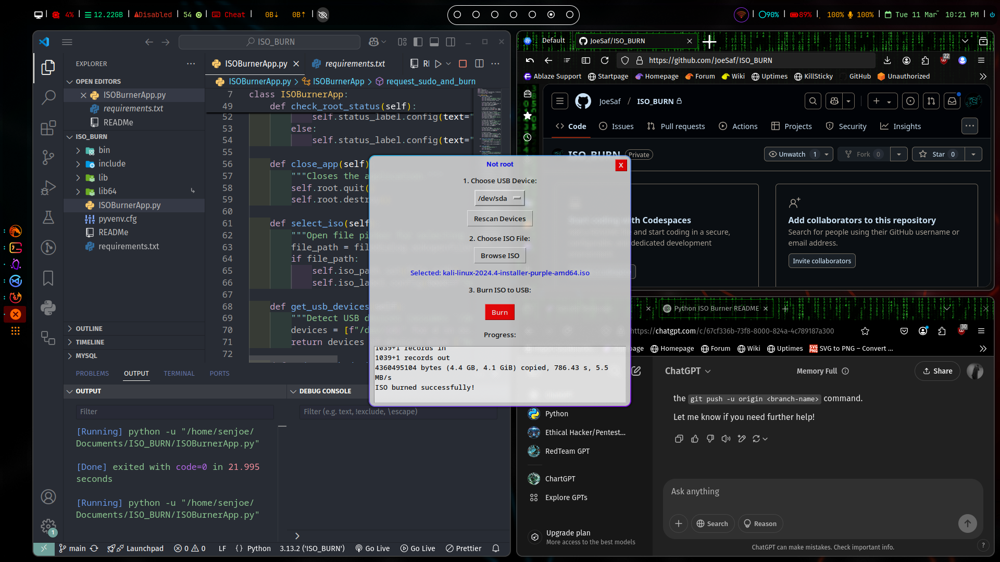

# ISO Burner (Linux Only)
A modern GUI application to easily burn ISO files to USB drives on Linux.



A simple Python application for burning ISO files to USB drives using a graphical interface built with Tkinter. This tool supports only Linux systems and allows users to easily create bootable USB drives from ISO images.

## Features
✅ GUI-based ISO burning  
✅ USB device detection  
✅ Progress tracking  
✅ Requires root for safe execution  

## Requirements

- Python 3.6 or later
- `Tkinter` for the GUI (usually included with Python)
- `subprocess` for running the burn command
- `dd` command (default on most Linux distributions)
- Linux-based OS (only supported on Linux for now)

## Installation

1. Clone the repository:
   ```bash
   git clone https://github.com/JoeSaf/ISO_BURN.git
   cd ISO_BURN
   ```

2. Set up a virtual environment (optional but recommended):
   ```bash
   python3 -m venv venv
   source venv/bin/activate

   OR

   source venv/bin/activate.fsh # fish shell
   ```

3. Install the required dependencies:
   ```bash
   pip install -r requirements.txt
   ```

4. Run the application:
   ```bash
   python ISOBurnerApp.py
   ```

## Usage

1. **Select USB Device:**
   - From the dropdown, choose the USB device where you want to burn the ISO. If no devices are listed, click "Rescan Devices" to update the list.

2. **Choose ISO File:**
   - Click "Browse ISO" to open a file picker and select an ISO file from your computer. The file name will be displayed on the window once selected.

3. **Burn ISO to USB:**
   - After selecting the USB device and ISO file, click "Burn" to begin the burning process. A confirmation dialog will appear asking you to confirm that the process will erase all data on the USB drive.
   - If you're not running as root, the application will prompt you for your root password.

4. **Progress:**
   - The burning process will start, and the progress will be displayed in the "Progress" section in real-time. Once the burn is completed successfully, you will receive a success message.

## Example

- To use the app, simply run the script:
  
  ```bash
  python ISOBurnerApp.py
  ```

- Select your USB device and ISO file, and then click "Burn" to start the process.

## Notes

- The application assumes you are running it on a Linux-based system.
- The `dd` command is used for burning the ISO. Be very careful when selecting the USB device, as it will overwrite all data on the drive.
- If you are not running as root, you will be prompted for the root password.
- This application is designed for Linux systems and is currently not compatible with macOS or Windows.

